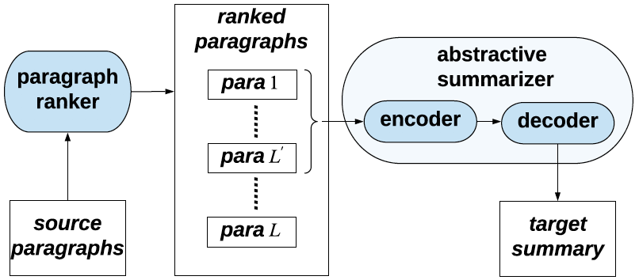
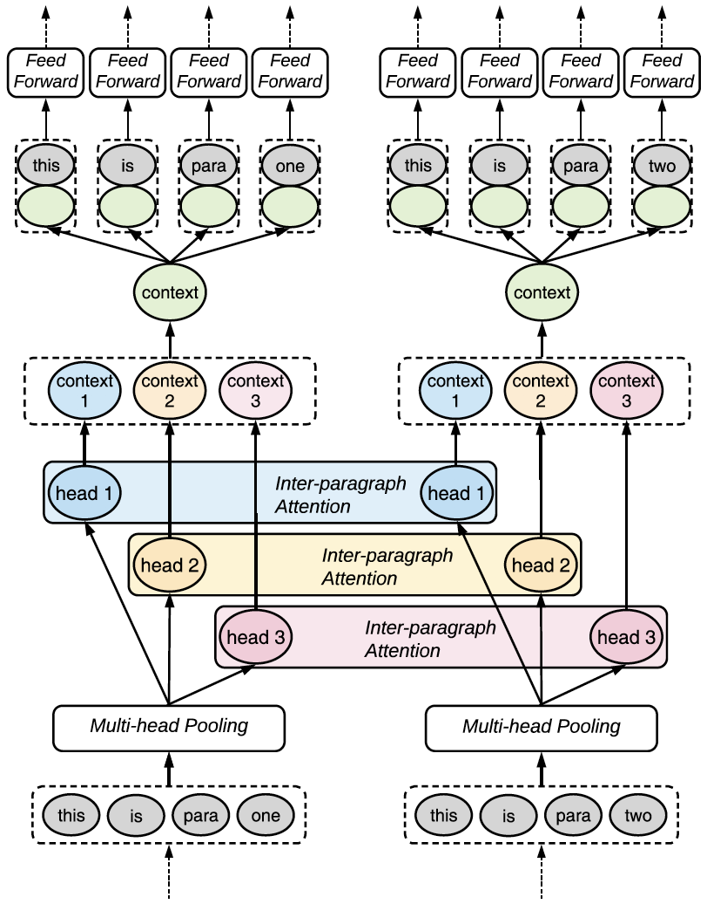
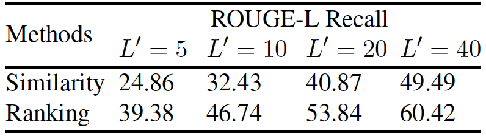
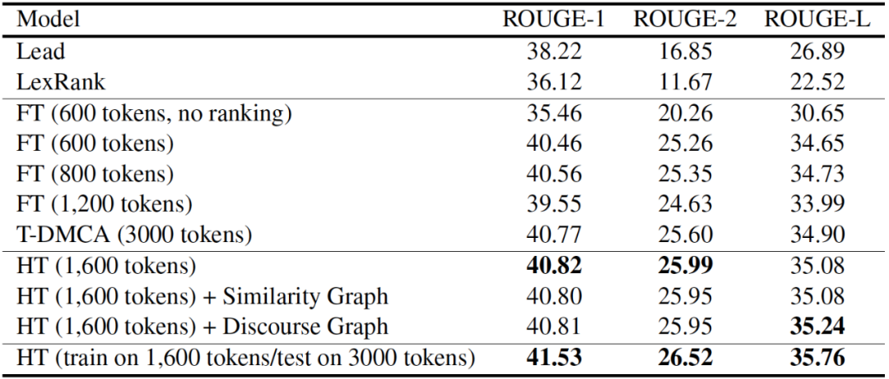
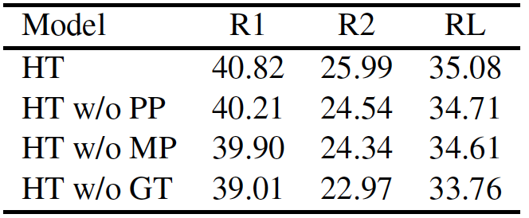

# Chinese-Multi-Document-Summarization
《**Hierarchical Transformers for Multi-Document Summarization**》文章的复现！
# 中文多文档摘要

这是复现《**Hierarchical Transformers for Multi-Document Summarization**》

**Paper :** https://arxiv.org/abs/1905.13164?context=cs.CL

**Github:** https://github.com/nlpyang/hiersumm

代码部分是参考原作者

数据是Multi_news中文翻译过来的

### 以下是论文内容

+ 前言

多文档摘要技术在舆情监控、商业分析、知识工程方面有许多应用。随着公开数据集越来越多，单文档摘要技术越来越强大，不仅限于经典的基于TextRange的抽取式方法，随着Transformer架构的诞生，生成式摘要技术上也有突破。但是多文档摘要的技术的研究仍然较少。多文档摘要的难点在于解决摘要间的高冗余度和可读性问题。训练数据的缺乏是多文档摘要技术瓶颈的一个重要原因，而人工撰写上百篇文章摘要需要太多人力成本。本文所介绍的论文在生成多文档训练数据和设计模型上均有创新。

+ 摘要

将端到端模型应用于多文档摘要的一个主要障碍是源文档的大小和数量可能非常大。因此，它实际上是不可行的(给定当前硬件的内存限制)训练一个模型，将它们编码成向量并随后生成摘要。

+ 动机

本文，作者提出了一个用于处理多文档摘要任务的生成式模型，其主要目的是反驳谷歌大脑提出的一个用分层编码输入文档的Transformer摘要模型：

该文章提出了一个两阶段的架构，其中抽取式模型首先选择重要段落的子集，然后由一个生成式模型生成摘要，同时对提取的子集进行条件设置。尽管该工作使得生成式摘要迈出重要一步，但它仍然将多个输入文档视为连接的平面序列，不知道文档之间的层次结构和关系。

作者通过注意力机制来表示跨文档之间的关系，该机制允许文档共享信息，而不是简单讲文本跨度连接起来作为扁平序列进行处理。本文模型不但学习了文档单位之间潜在的依赖关系，还可以利用关注相似度或话语关系的显性图表示。

+ 前人工作介绍

  + 1、大多数先前的多文档摘要方法都是基于句子或者段落的图表示上进行抽取操作。方法的不同取决于如何计算边的权重，或者在最后的总结中对包含的文本单元进行排序所采用的具体算法。

    + Lexrank:Graph-based lexical centrality as salience in text summarization.（2004）

    + Towards coherent multi-document summarization.（2013）

    + Graph-based neural multi-document summarization.（2017）

  + 2、生成式方法

    + 1）有一些系统基于句子融合来生成摘要，这是一种识别在文档间传递公共信息的片段并将其组合成句子的技术。

      + Sentence fusion for multi-document news summarization.（2005）

      + Sentence fusion via dependency graph compression.（2008）

      + Abstractive multi-document summarization via phrase selection and merging.（2015）

    + 2）神经网络生成式模型在单文档摘要中取得了良好的效果。但是将序列到序列架构扩展为多文档摘要就不那么简单了。

      + Get to the point: Summarization with pointer generator networks.（2017）

      + A deep reinforced model for abstractive summarization.（2018）

      + Bottom-up abstractive summarization.（2018）

      + Deep communicating agents for abstractive summarization.（2018）

  + 3、除了缺乏足够的训练数据外，神经网络模型还面临处理多源文档的计算挑战

    + 1）模型迁移：通过单文档摘要数据集训练一个序列到序列(seq2seq)的模型,并且在多文档摘要数据集(如：DUC)进行微调。

      + Adapting neural single-document summarization model for abstractive multi-document summarization: A pilot study.（2018）

      + Automatic detection of vague words and sentences in privacy policies.（2018）

    + 2）依赖于重建目标的无监督模型。

      + An unsupervised multi-document summarization framework based on neural document model.（2016）

      + Unsupervised neural multi-document abstractive summarization.（2018）

+ 模型结构

本文所提模型结构图：

#### 1、生成训练数据

作者选择从WIKI百科这样的高质量语料数据中生成<摘要，多文档>对作为训练数据。摘要是维基百科中文章的首个段落，而文档来自百科的引用参考文献和Google搜索文章题目得出的Top10篇文章。模型的输入是WIKI百科标题+多文档段落，目标输出是文章的首个段落。

#### 2、段落排序（Paragraph Ranking）

考虑到不同文章篇幅的巨大差异，会给设备带来难以估计的计算压力。作者是使用一个自然段作为单元来进行摘要，设计段落排序模型筛选出主题相关度高的段落。将每篇文章按换行符进行段落划分，使用LSTM对文档和段落进行提取特征并用逻辑回归进行打分排序。

段落排序模型计算过程如下：

LSTM对标题和段落进行特征提取【其中wti和wpi分别是标题T和段落P中每个token的word embedding】:

{ut1;...;utm} = lstmt({wt1;...;wtm})         (1)

{up1;...;upm} = lstmp({wp1;...;wpm})    (2)

对标题特征Ut进行最大池化操作，获取标题摘要特征:u^t = maxpool({ut1;...;utm})    (3)

将段落特征与标题摘要特征进行拼接，池化，打分，相当于一个计算各个段落关于主题相关程度的过程【s是一个分数，暗示P是否应该被选为摘要】:

pi = tanh(W1([upi;u^t]))        (4)

p^ = maxpool({p1;...;pn})    (5)

s = sigmoid(W2(p^))            (6)

作为训练标签的真实得分通过Rouge-2召回计算得到的，即计算每个段落相对于首个段落的ROUGE得分。【备注：ROUGE（基于召回）是评价摘要质量的重要标准，类似于机器翻译中的BLEU（基于准确度）】

至此，排序模型就可以进行训练然后排序出用于计算摘要的多个段落。

#### 3、段落编码（Paragraph Encoding）

按照相似度分数选择了前K个最相关片段用作生成模型的输入后，并非直接将所有片段拼接作为一个长输入，而是采用了一个基于Transformer结构的分层模型来预先捕获段落与段落之间的关系。

模型由多个local和global的Transformer层构成，其堆叠关系是随意的。定义符号tij表示第i个段落的第j个字符的表示；而每一层的输出都作为下一层的输入。

（2）Inter-paragraph Attention【模拟段落间的依赖关系】

（3）Feed-forward Networks

##### Embedding

1）由于Transformer是非自回归模型无法捕获字符与字符之间的位置关系，故也按Transformer论文中的奇数偶数位置的方法加入了位置编码：

ep[i] = sin(p/100002i/d)             (7)

ep[2i + 1] = cos(p/100002i/d)    (8)

ep[i]表示embedding向量的第i个维度。每个位置编码的维度都可以联系到正弦波的波峰位置上，由此可以表示输入元素的相对位置。

2）在多文档摘要中，字符tij有两个位置需要被考虑，i表示按重要性排序的第i个段落，而j表示该词位于该段落的第j个位置。而最后的位置编码为：peij = [ei; ej]    (9)

最终得到一个输入向量：x0ij = wij + peij    (10)

【wij → 分配给标题tij的embedding ；peij → 分配给标题tij的位置embedding，表示一个输入中每个token的位置】

##### Local Transformer Layer    🚩用来编码段落内部的每一个token上下文信息。

归一化多头注意力（获得了段落中每一个字符对段落中其余字符的self-attention分数）

FFN是一种以ReLU作为隐藏激活函数的两层前馈网络，是一层线性层

h = LayerNorm(xl-1 + MHAtt(xl-1))    (11)

xl = LayerNorm(h + FFN(h))               (12)

##### Global Transformer Layer

用来交换段落与段落之间的信息，如下图 Global Transformer Layer

首先，应用multi-head pooling对每个段落进行操作，不同的heads将以不同的attention权重编码段落；然后，对于每一个head，一个Inter-paragraph Attention机制被应用。通过自注意力机制，每一个段落可以从其他段落中收集信息，生成向量来捕捉整个输入的上下文信息；最后，上下文向量可以被concated、linear transformed、增加到每个token的向量中，并且喂到feed-forward层，用全局信息（global information）更新每个token的表示。

（1）Multi-head Pooling【获得固定长度的段落表示】

思路与多头自注意力机制类似，先将上一层的特征向量多次映射到低维空间，再进行注意力加权。这个使得长度不同的段落都映射到同一维度。

xl-1ij ∈ Rd 表示token tij上一层transformer层的输出向量，也是当前层的输入向量。

对于每个段落Ri，都有头z ∈ {1;...;nhead}。首先对输入计算attention分数azij以及一个value分数bzij。并对每个头在段落所有字符中都计算一个attention概率分布a^zij：

azij = WzaXl-1ij                   (13)

bzij = WzbXl-1ij                   (14)

a^zij = exp(azij)/∑nj=1exp(azij)    (15)

然后通过线性变化和层归一化获得每个头对应的向量表示：

headzi = LayerNorm(Wzc∑nj=1azijbzij)    (16)

在获得了各个段落的多头表示后：采用Inter-paragraph Attention的机制让各个头中不同段落的向量进行交互：

qzi = Wzqheadzi      (17)

kzi = Wzkheadzi       (18)

vzi = Wzvheadzi       (19)

contextzi = ∑mi=1(exp(qzTi kzi')/(∑mo=1exp(qzTikzo)))vzi’    (20)

通过一个前馈神经网络融合各个头的上下文表示：

ci = Wc[context1i;...;contextnheadi]    (21)

然后用ci来更新每个输入段落中的每个字符的表示：

gij = Wo2ReLU(Wo1(Xl-1ij + ci))    (22)

xlij = LayerNorm(gij + Xl-1ij)    (23)

这样经过local和global的attention就能让每个字符都经过一次分层的上下文更新。

##### Graph-informed Attention

作者认为他提出的这种Inter-paragraph Attention机制可以看作是让模型学习根据输入段落集合绘制一张隐式的图结构表示。而实际上其他的多文档摘要大多都是借助显示构建这种层次图来对段落取得深入表示。

因此作者多为这种假设（Inter-paragraph Attention）做了个辅助设置，即作者构造了两张图：

第一张图，节点为段落，边为段落与段落之间的余弦tf-idf相似度分数；

第二张图，节点依旧为段落，而边则是对段落与段落之间共现词的数量以及转折词的数量。

引入这样的图到模型中表示为一个矩阵G,其中Gii'表示链接段落i和i'之间的边的权值，然后在计算context向量时替换掉每个头学习得到的q, k, v：

contextz'i = ∑mi'=1(Gii'/∑mo=1Gio)vz'i'    (24)

 

+ 实验部分

数据集

WikiSum Dataset【train: 1579360 instances | dev: 38144 instances | test: 38205 instances】

实验一

使用tf-idf余弦相似度和我们的排序模型得到的L'-bset个最佳段落作为最终摘要【在ROUGE-L Recall中的得分情况】

实验二

Test set results on the WikiSum dataset using ROUGE F1.

对比模型：

Lead：经过paragraphs ranking之后直接抽取前k个单词作为摘要。

LexRank：构建一个图以段落为节点，边为余弦tfidf分数，通过一个类似PageRank的图排序算法获得最优的段落，并截取一定长度作为摘要。

Flat-Transformer：直接将排序/无排序的段落拼接作为输入，并按照600/800/1200的长度在编码阶段截断。

T-DMCA：同样出自一篇用transformer结构的编解码器处理多文档摘要的文章：该模型是一个对Transformer解码器的简单实现，通过采用Memory Compressed Attention。简单来说就是通过一个卷积层来压缩q，k，v用于self-attention。

HT（本文所提模型）

实验三

Hierarchical Transformer and versions thereof without (w/o) paragraph position (PP), multi-head pooling (MP), and global transformer layer (GT).

原文链接：https://blog.csdn.net/u014577702/article/details/116377227
